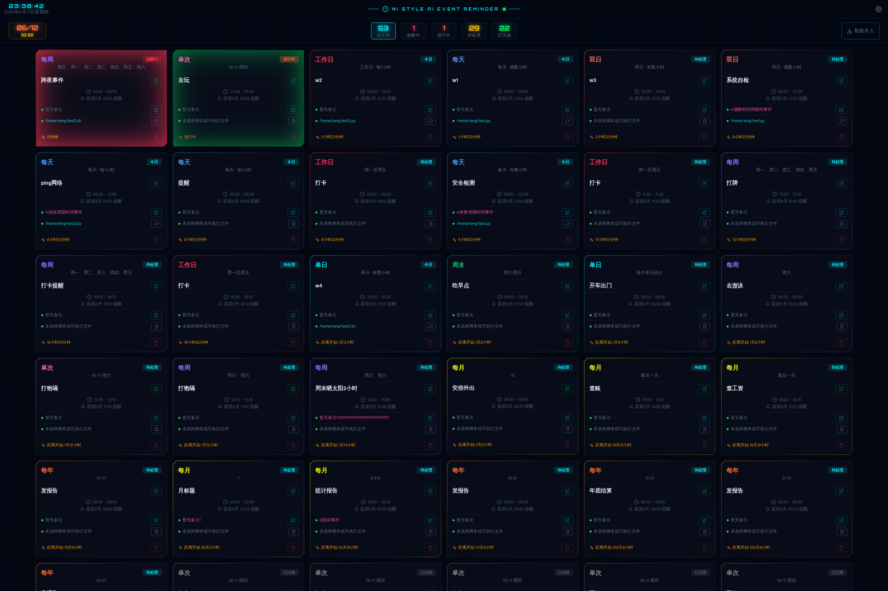
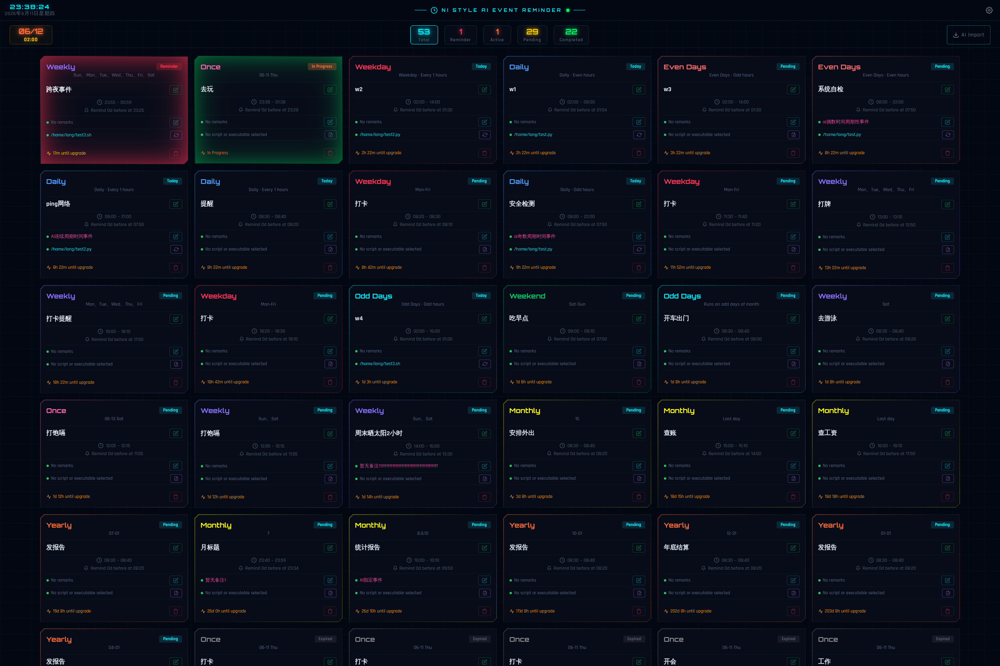

# NiNote

> **NI STYLE AI EVENT REMINDER** — AI 驱动的跨平台定时提醒与日程管理桌面应用

---

## 界面概览

顶部栏显示实时时钟、连接状态和设置入口。中间统计栏显示最近事件、总数、待处理、进行中、提醒中，点击可筛选列表。主区域以卡片网格展示所有日程，每张卡片显示标题、类型、时间、状态和备注。



---

## 快速开始

### 1. 配置 AI 模型

首次使用先设置 AI 模型，否则智能导入无法使用：

1. 点击右上角 ⚙ 进入**设置**
2. 填写**模型名称** （默认 `deepseek-v4-flash`）
3. 填写**API 地址**（默认 `https://api.deepseek.com`）
4. 填写**API Key**
5. 点击「测试连接」验证，然后「保存」

### 2. 添加你的第一个日程

点击顶部导航的**「智能导入」**，在文本框中输入自然语言描述，例如：

```
每个工作日 9:00 提醒我开晨会
月底最后一天 18:00 检查工资条
每周一三五 20:00 去健身房
每天 22:00 检查安全日志
晚上 7 点去打球 2 小时
```

点击「智能解析」查看结果，确认无误后点击「确认导入」。

---

## 日程类型

| 类型 | 说明 | 示例 |
|---|---|---|
| 单次 | 指定日期执行一次 | 2026-06-10 14:00 去北京 |
| 每天 | 每天固定时间 | 每天 9:00 打卡 |
| 工作日 | 周一至周五 | 工作日 18:00 写日报 |
| 周末 | 周六周日 | 周末 10:00 打扫卫生 |
| 每周 | 指定星期几 | 每周一三五跑步 |
| 每月 | 指定每月几号 | 每月 15 日做报表 |
| 每年 | 指定月日 | 每年 6.1 发祝福 |
| 单日 | 每月日期为奇数的日子 | 单日巡检设备 |
| 双日 | 每月日期为偶数的日子 | 双日买彩票 |

### 小时级重复

在以上类型基础上，可叠加小时级调度：

- **每 N 小时**：每天 8:00~22:00 每 2 小时做一次安全检测
- **偶数小时**：仅在偶数整点触发
- **奇数小时**：仅在奇数整点触发

### 跨夜事件

结束时间早于开始时间时，自动识别为跨夜事件（如 `22:00~06:00` 夜间作业）。

---

## AI 智能导入

输入自然语言，AI 自动解析为结构化日程。

**支持的中文语法示例：**

```
年底结账
双日我要买彩票
一个小时后去喝茶
每月15日完成台账
晚上7点去打球2小时
月底18点提醒我查工资
工作日每小时看一下指标
周末12:05都提醒我打饱嗝
每天8点到22点偶数小时安全检测
每天8:20 11:30 12:20提醒我打卡
单日提前半小时提醒我8点半开车出门
我14点要去北京,提前一个小时提醒我
2026年6月10日 0:00~06:00 夜间作业 提前一天16点通知
```

解析结果会显示每条计划及其过期状态，可逐条确认后批量导入。重复项会自动标记。

### 手动输入

不想用 AI 时，可点击「手动录入」按钮，通过表单逐项填写：

- **标题**：日程名称
- **周期类型**：单次/每天/每周/每月/每年/单日/双日/月末/年底
- **日期/时间**：开始时间、结束时间（可选）
- **小时级重复**：不启用/每 N 小时/偶数小时/奇数小时
- **提前提醒**：提前几小时提醒
- **星期/日**：根据周期类型显示对应的选择项
- **备注**：可选附加信息

---

## 文件执行

每个日程可以关联一个脚本或可执行文件：

1. 点击日程卡片的「选择文件」按钮，通过系统文件对话框选择脚本
2. 日程进入进行中状态时，关联文件**自动执行**
3. 点击卡片上的「执行详情」可查看历史执行记录

**执行记录包含：**
- 执行时间与耗时
- 退出码（0=成功，非0=失败）
- stdout 标准输出日志
- stderr 错误输出日志

支持的脚本类型取决于操作系统（`.bat`、`.ps1`、`.sh`、`.exe` 等）。

> Windows 下执行控制台程序时不会弹出黑色命令窗口。

---

## 日程操作

| 操作 | 方式 |
|---|---|
| 编辑标题 | 点击标题文字直接编辑 |
| 编辑备注 | 点击备注文字直接编辑 |
| 关联文件 | 点击「选择文件」按钮 |
| 查看执行记录 | 点击卡片上的执行详情区域 |
| 删除日程 | 点击删除按钮（不可撤销） |

---

## 提醒机制

- 程序后台每 5 秒检查一次所有日程
- 到达提醒时间时，弹出脉冲动画提醒窗口
- 显示站点名称、日期、时段、提醒类型
- 点击「已读确认」关闭提醒
- 状态栏的「提醒中」显示当前正在提醒的数量

---

## 常见问题

**Q: 智能导入提示"解析失败"？**
A: 请先检查设置中的模型名称、API 地址和 API Key 是否正确，点击「测试连接」验证。

**Q: 日程到了时间没有提醒？**
A: 检查日程是否已手动确认过（状态显示"已完成"则不会再提醒），以及提醒时间设置是否正确。

**Q: 文件执行没有反应？**
A: 确保关联的文件路径存在且为可执行文件（Linux 需 `chmod +x`，Windows 下 `.exe`、`.bat`、`.ps1` 均可）。

**Q: 支持哪些 LLM 模型？**
A: 任何兼容 OpenAI API 格式的模型均可，如 DeepSeek、MiniMax、通义千问、本地部署的 ollama 等。

---

## 技术说明

- **存储**：数据存储在本地 SQLite 文件中，无需联网
- **更新**：启动时自动检查新版本，点击「下载」在浏览器中下载安装包
- **日志**：程序运行日志输出到终端或日志文件，方便排查问题

---

# NiNote

> **NI STYLE AI EVENT REMINDER** — An AI-powered cross-platform desktop reminder & schedule manager

---

## Interface Overview

The top bar shows a live clock, connection status, and the settings button. The stats bar in the middle displays next event, total, pending, active, and reminder counts — click any stat to filter the list. The main area shows all schedules as cards in a grid layout.



---

## Quick Start

### 1. Configure AI Model

The AI import feature requires a valid LLM configuration:

1. Click the ⚙ icon (top right) to open **Settings**
2. Enter **Model Name** (default: `deepseek-v4-flash`)
3. Enter **API URL** (default: `https://api.deepseek.com`)
4. Enter your **API Key**
5. Click "Test Connection" to verify, then "Save"

### 2. Add Your First Schedule

Navigate to **"AI Import"** in the top nav bar, type natural language descriptions like:

```
Remind me to have a morning meeting at 9:00 every weekday
Check my salary at 18:00 on the last day of each month
Go to the gym at 20:00 every Mon, Wed, Fri
Check security logs at 22:00 daily
Play basketball at 7pm for 2 hours
```

Click "AI Parse" to preview the structured results, then "Import" to confirm.

---

## Schedule Types

| Type | Description | Example |
|---|---|---|
| Once | Single date | Go to Beijing at 14:00 on 2026-06-10 |
| Daily | Every day at fixed time | Clock in at 9:00 daily |
| Weekday | Monday to Friday | Write daily report at 18:00 |
| Weekend | Saturday & Sunday | Clean the house at 10:00 on weekends |
| Weekly | Specific days of week | Run every Mon, Wed, Fri |
| Monthly | Specific day of month | Do reports on the 15th |
| Yearly | Specific month+day | Send wishes on June 1 |
| Odd days | Days with odd date numbers | Inspect equipment on odd days |
| Even days | Days with even date numbers | Buy lottery on even days |

### Hourly Sub-schedules

Layer on top of any schedule type:

- **Every N hours**: security check every 2 hours from 8:00 to 22:00
- **Even hours**: trigger only on even hours
- **Odd hours**: trigger only on odd hours

### Cross-night Events

When end_time is earlier than start_time, the event is automatically detected as spanning midnight (e.g., night shift `22:00~06:00`).

---

## AI Import

Type or paste natural language text, and the AI parses it into structured schedules.

**Supported English syntax examples:**

```
Year-end checkout
Buy lottery on even days
Complete account book on the 15th each month
Play basketball at 7pm for 2 hours
Remind me to check my salary at 18:00 at month end
Check metrics every hour on workdays
Remind me to hiccup at 12:05 on weekends
Security check every even hour from 8am to 10pm
Remind me to clock in at 8:20, 11:30, 12:20 daily
Remind me to drive at 8:30 on odd days, 30 min early
I need to go to Beijing at 14:00, remind me one hour in advance
Night work on 2026-06-10 00:00~06:00, notify at 16:00 one day in advance
```

### Manual Input

For non-AI entry, click "Manual Input" and fill in the form:

- **Title**: schedule name
- **Schedule type**: Once / Daily / Weekly / Monthly / Yearly / Odd days / Even days / Month end / Year end
- **Date/Time**: start time, end time (optional)
- **Hourly repeat**: disabled / every N hours / even hours / odd hours
- **Advance reminder**: remind N hours before
- **Day of week / date**: context-sensitive options based on schedule type
- **Remarks**: optional notes

---

## File Execution

Each schedule can be linked to a script or executable:

1. Click "Select File" on the schedule card, pick a script via the native file dialog
2. When the event period starts, the linked file **executes automatically**
3. Click the execution details area to view run history

**Execution records include:**
- Run time and duration
- Exit code (0 = success, non-zero = failure)
- stdout log
- stderr error log

Supported script types depend on your OS (`.bat`, `.ps1`, `.sh`, `.exe`, etc.).

> On Windows, console programs run without showing a command window.

---

## Schedule Operations

| Action | How |
|---|---|
| Edit title | Click the title text directly |
| Edit remarks | Click the remarks text directly |
| Link file | Click "Select File" button |
| View execution log | Click the execution details area |
| Delete | Click the delete button (irreversible) |

---

## Reminder System

- A background check runs every 5 seconds evaluating all schedules
- When a reminder triggers, a pulsing glow dialog appears
- Shows station name, date, time range, and reminder type
- Click "Acknowledge" to dismiss
- The "Reminder" stat shows active reminder count

---

## FAQ

**Q: AI import shows "Parse failed"?**
A: Check your model name, API URL, and API Key in Settings. Click "Test Connection" to verify.

**Q: No reminder when schedule time arrives?**
A: Check if the schedule was already acknowledged (status "Done" = won't remind again), and verify the reminder time is set correctly.

**Q: File execution doesn't work?**
A: Make sure the linked file path exists and is executable (Linux: run `chmod +x`; Windows: `.exe`, `.bat`, `.ps1` all work).

**Q: Which LLM models are supported?**
A: Any model compatible with the OpenAI API format: DeepSeek, MiniMax, Qwen, locally hosted ollama, etc.

---

## Technical Notes

- **Storage**: All data is stored in a local SQLite file; no network connection required
- **Updates**: Checks for new versions on startup; click "Download" to open the installer in your browser
- **Logs**: Output to terminal or log files for troubleshooting
